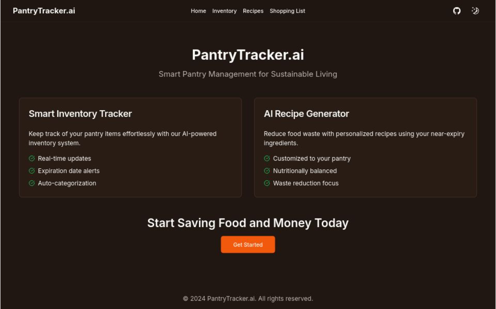
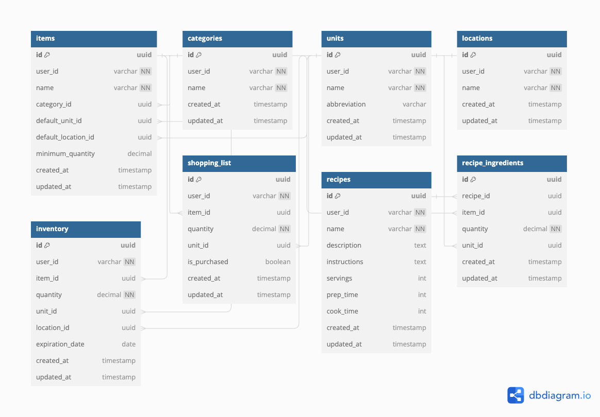

# PantryTracker.ai


[](https://www.youtube.com/watch?v=TndjQt7Z8pU)

PantryTracker.ai is a smart pantry management system designed to help you reduce food waste, save money, and simplify meal planning.

## Features

- **Smart Inventory Tracker**: Keep track of your pantry items effortlessly with our AI-powered inventory system.

  - Real-time updates
  - Expiration date alerts
  - Auto-categorization

- **AI Recipe Generator**: Reduce food waste with personalized recipes using your near-expiry ingredients.

  - Customized to your pantry
  - Nutritionally balanced
  - Waste reduction focus

- **Shopping List Management**: Streamline your grocery shopping with intelligent list generation based on your inventory and meal plans.

## Tech Stack

- Next.js
- React
- TypeScript
- Shadcn UI
- Clerk for authentication
- Supabase for database and backend services
- Flowise for AI workflow automation

## Database Schema



## Getting Started

1. Clone the repository:

   ```bash
   git clone https://github.com/knhn1004/pantry-tracker.git
   ```

2. Install dependencies:

   ```bash
   npm install
   # or
   yarn install
   # or
   pnpm install
   # or
   bun install
   ```

3. Set up environment variables:
   Copy the .env.example file to .env.local and update the values:

```bash
cp .env.example .env.local
```

4. Run the development server:

```bash
npm run dev
# or
yarn dev
# or
pnpm dev
# or
bun dev
```

5 .Open http://localhost:3000 with your browser to see the result.

## Flowise API

Deploy your own Flowise instance and load json file from `flowise` folder to your instance.

> **Note**: Flowise API is not included in this repository. Due to limitation, the flowise server may not be available at all times.
